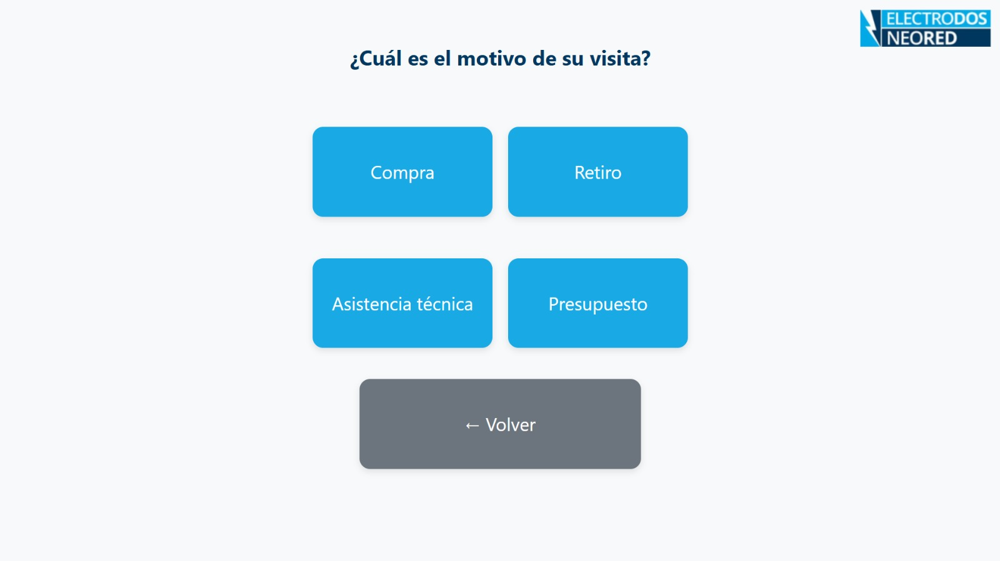
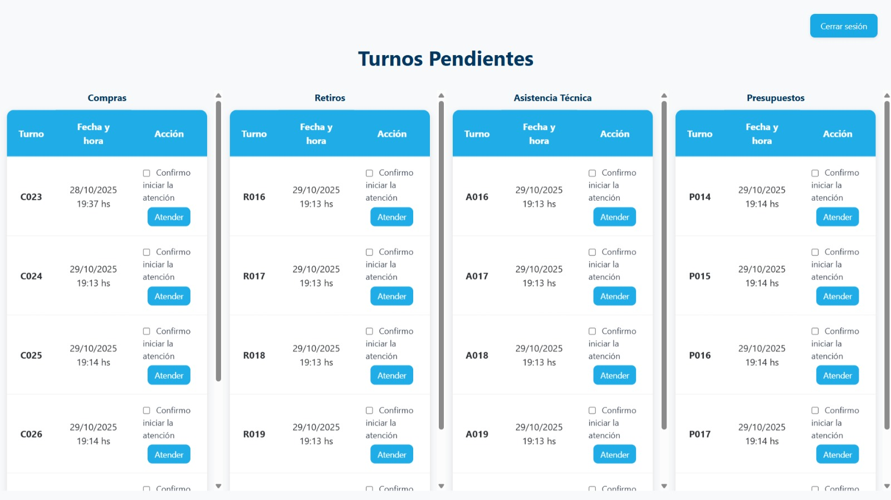

# Sistema de Turnos para Electrodos 🎫

  

  
  
  
  
  

---

## 📋 Índice

1. [Descripción del Proyecto](#-descripción-del-proyecto)
2. [Características](#-características)
3. [Tecnologías Utilizadas](#-tecnologías-utilizadas)
4. [Estructura del Proyecto](#-estructura-del-proyecto)
5. [Capturas de Pantalla](#-capturas-de-pantalla)
6. [Instalación](#-instalación)
7. [Configuración](#-configuración)
8. [Uso](#-uso)
9. [Impresión Automática](#-impresión-automática)
10. [FAQ](#-faq)

---

## 📖 Descripción del Proyecto

Sistema completo de gestión de turnos para Electrodos, diseñado para optimizar la atención al cliente mediante:

- **Totem táctil** para que los clientes saquen turnos de forma autónoma
- **Panel del trabajador** para gestionar la cola de atención
- **Impresión térmica automática** de tickets con impresora Zebra ZD220
- **Chatbot interactivo con IA** desarrollado con n8n para automatización de consultas y procesos administrativos

El sistema elimina las colas físicas, mejora los tiempos de espera, automatiza respuestas a consultas frecuentes y proporciona métricas de gestión para análisis de eficiencia operativa.

---

## ✨ Características

### 🖥️ Totem
- ✅ 4 motivos de atención: Compra, Retiro, Asistencia Técnica, Presupuesto
- ✅ Numeración automática por motivo (C001, R001, A001, P001)
- ✅ Confirmación visual con número grande y legible
- ✅ Impresión automática del ticket al generar turno

### 👨‍💼 Panel del Trabajador
- ✅ Vista de turnos pendientes organizados por motivo
- ✅ Botones "Atender" y "Atendido" con confirmación obligatoria
- ✅ Registro automático de tiempos (creación, inicio atención, fin atención)
- ✅ Cierre de sesión seguro con bloqueo de navegación "Atrás"

### 🖨️ Impresión Térmica
- ✅ Integración con Zebra ZD220 vía USB usando Browser Print SDK
- ✅ Etiquetas personalizadas de 10×8 cm
- ✅ Impresión automática sin intervención del usuario

### 🤖 Chatbot con IA (n8n)
- ✅ Chatbot integrado en panel administrativo
- ✅ Respuestas con inteligencia artificial a consultas del usuario
- ✅ Conexión con base de datos vectorial para consultas en tiempo real
- ✅ Acceso mediante interfaz web embebida
- ✅ Sistema de búsqueda híbrida en la BD vectorial utilizando búsqueda semántica y keywords

### 🔐 Seguridad
- ✅ Autenticación con roles (trabajador, totem, admin)
- ✅ Contraseñas hasheadas
- ✅ Sistema de recuperación de contraseña con tokens de un solo uso

---

## 🛠️ Tecnologías Utilizadas

| Tecnología | Versión | Uso |
|------------|---------|-----|
| **PHP** | 8.0+ | Backend y lógica de negocio |
| **MariaDB/MySQL** | 10.x | Base de datos relacional |
| **HTML5 + CSS3** | - | Frontend sin frameworks |
| **Bootstrap** | 5.3.3 | Estilos del panel (opcional) |
| **Zebra Browser Print** | 3.1.250 | Comunicación con impresora |
| **ZPL II** | - | Lenguaje de impresión Zebra |
| **n8n** | Latest | Automatización de workflows y chatbot |

---

## 📁 Estructura del Proyecto

sistema-turnos-electrodos/
├── README.md # Este archivo
├── screenshots/ # Capturas de pantalla
│ ├── chatbot.jpg
│ ├── confirmacion.jpg
│ ├── logine2.jpg
│ ├── panel-trabajador.jpg
│ ├── sacar-turno.jpg
│ └── seleccion.jpg
│
└── tp/ # Código fuente
├── interfaz/
│ ├── js/
│ │ └── BrowserPrint-3.1.250.min.js
│ ├── inicio.html # Bienvenida kiosco
│ ├── seleccion.php # Selección de motivo
│ ├── generar_turno.php # Lógica de generación
│ ├── confirmacion.php # Confirmación + impresión
│ ├── plantilla_turno.php # Generador ZPL
│ ├── panel_trabajador.php # Gestión de turnos
│ ├── admin.php # Vista admin con n8n
│ ├── logout_trabajador.php # Cierre de sesión
│ └── style.css # Estilos globales
│
└── login/
├── login.php # Formulario de login
├── verificar_login.php # Autenticación
├── registro.php # Alta de usuarios
├── procesar_registro.php # Procesamiento
├── recuperar_clave_form.php # Form recuperación
├── recuperar_clave.php # Generación de token
├── recuperar_clave_ext.php # Validación de token
└── con_db.example.php # Ejemplo de conexión DB

---

## 📸 Capturas de Pantalla

### Kiosco - Pantalla de Inicio

*Interfaz limpia y táctil para que los clientes saquen turnos sin asistencia*

### Selección de Motivo

*Cuatro opciones claras: Compra, Retiro, Asistencia Técnica y Presupuesto*

### Confirmación de Turno

*Número grande y visible + impresión automática del ticket*

### Panel del Trabajador

*Vista en tiempo real de turnos pendientes organizados por motivo*

### Login del Sistema

*Sistema de autenticación seguro con roles*

### Chatbot Administrativo (n8n)

*Chatbot con IA integrado en el panel admin para consultas automatizadas*

## ❓ FAQ

### ¿Cómo evito turnos duplicados?

El sistema usa transacciones con `GET_LOCK()` por motivo para asegurar atomicidad en la numeración, evitando colisiones cuando múltiples tablets generan turnos simultáneamente.

### ¿Puedo usar etiquetas de otro tamaño?

Sí, modifica `^PW` y `^LL` en `plantilla_turno.php`. Usa la fórmula: `mm × 7.99 = puntos` (a 203 dpi).

### ¿Funciona sin impresora?

Sí, el sistema sigue operando normalmente. La impresión falla silenciosamente (registra en consola) sin interrumpir la UX del kiosco.

### ¿Cómo agrego más motivos?

1. Edita el array `$prefijos` en `generar_turno.php`
2. Agrega botón correspondiente en `seleccion.php`
3. Actualiza mapeo en `plantilla_turno.php`

### ¿El chatbot n8n funciona offline?

No, requiere conexión a internet si usas servicios externos de IA. Puedes configurarlo para trabajar solo con la base de datos local.

### ¿Cómo actualizo la contraseña de un usuario?

// Genera hash:
$nueva_password = password_hash('nueva_contraseña', PASSWORD_DEFAULT);

// Actualiza en BD:
UPDATE usuarios SET password_cifrada = '$nueva_password' WHERE username = 'usuario';

## 📄 Licencia

Este proyecto es de uso interno para ElectroDosNeored

---

## 📧 Contacto

**Electrodos S.A.**  
Web: ElectroDosNeored
